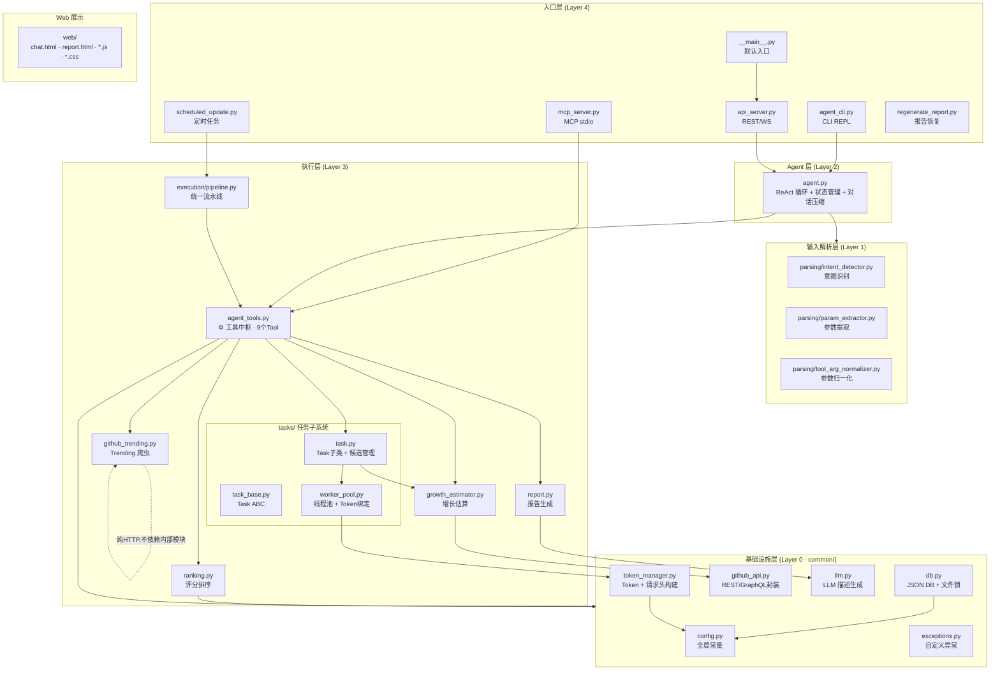
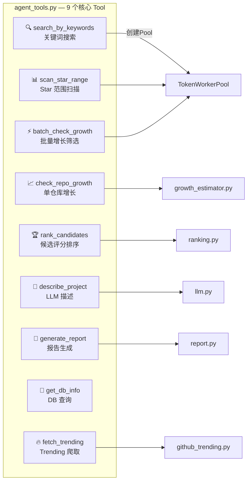
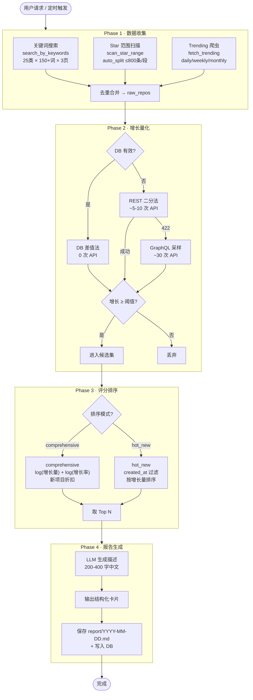
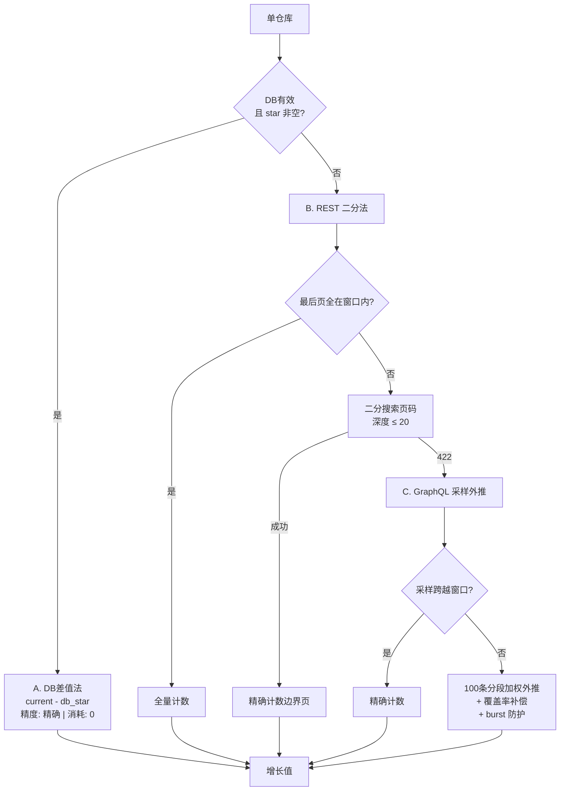
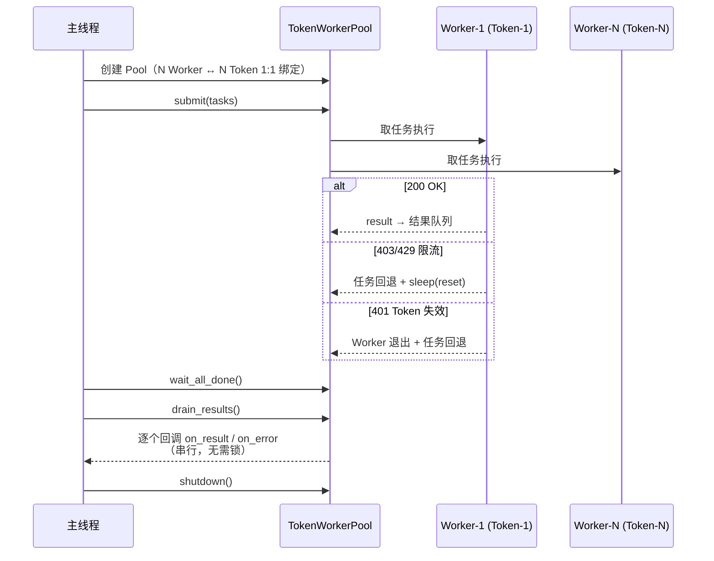
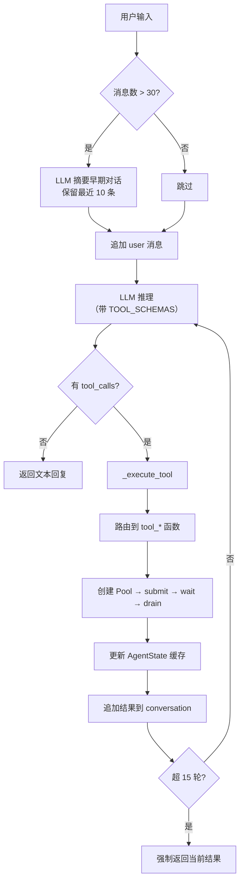
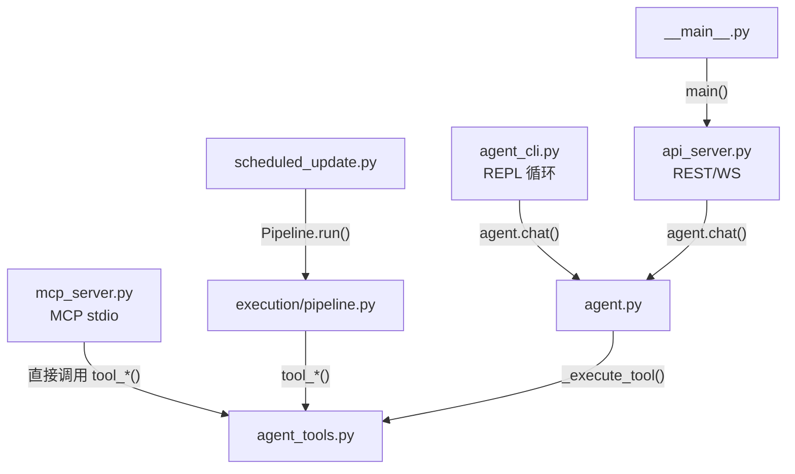

# GitHub 热门项目发现系统 — 设计文档

## 1. 设计目标与约束

### 1.1 核心需求
自动发现 GitHub 近期 star 增长最快的开源项目，生成结构化中文报告。

### 1.2 设计约束
- GitHub REST API 限制 5000 次/小时/Token，Search API 限制 30 次/分钟
- Search API 单次查询最多返回 1000 条结果
- Stargazers REST 分页在高 star 仓库（>40k）时返回 422
- 需支持多 Token 并行以提升吞吐
- 需支持交互式（CLI）、API（Web）、MCP 三种使用模式

### 1.3 技术选型
Python 3.10+, requests, FastAPI, JSON 文件存储, OpenAI 兼容 LLM, MCP SDK

---

## 2. 分层架构总览



### 2.1 分层说明

| 层级 | 名称 | 职责 | 包含文件 |
|------|------|------|---------|
| **L0** | 基础设施层 | 配置、存储、API 封装、Token 管理 | `common/` 全部 6 个模块 |
| **L1** | 输入解析层 | 意图识别、参数提取、归一化（纯函数） | `parsing/` 全部 3 个模块 |
| **L2** | Agent 层 | ReAct 推理循环、状态管理、对话压缩 | `agent.py` |
| **L3** | 执行层 | 9 个 Tool 实现 + 评分/报告/增长/爬虫/任务子系统 | `agent_tools.py`, `ranking.py`, `report.py`, `growth_estimator.py`, `github_trending.py`, `execution/`, `tasks/` |
| **L4** | 入口层 | CLI / API / MCP / 定时任务等启动入口 | `__main__.py`, `agent_cli.py`, `api_server.py`, `mcp_server.py`, `scheduled_update.py`, `regenerate_report.py` |

### 2.2 设计原则
- **模式统一**：CLI / API / MCP 三入口共享 agent_tools 中的 Tool 实现
- **Token 隔离**：每个 Worker 绑定唯一 Token，消除跨线程竞争
- **主线程回调**：所有数据写入（DB、候选集）在主线程 drain_results 中执行，无需额外锁
- **降级容错**：REST → GraphQL → 保守估算，每层失败都有退路
- **非侵入参数**：新增参数不传时行为等同参数添加前

---

## 3. 核心工具一览



| Tool | 创建 Pool | 写 DB | 说明 |
|------|----------|-------|------|
| search_by_keywords | ✅ | — | 25 类关键词多页搜索 |
| scan_star_range | ✅ | — | auto_split_star_range 递归二分 |
| check_repo_growth | — | — | 单仓库详情 + LLM 描述 |
| batch_check_growth | ✅ | 内存 | 批量增长计算 + checkpoint |
| rank_candidates | — | — | comprehensive / hot_new 排序 |
| describe_project | — | 内存 | 单项目 LLM 描述 |
| generate_report | — | 磁盘 | Markdown 报告 + DB 持久化 |
| get_db_info | — | — | 只读查询 |
| fetch_trending | — | — | HTML 爬虫，零 API 消耗 |

---

## 4. 端到端数据流

### 4.1 完整发现流程



### 4.2 三级增长降级详图



---

## 5. 并发模型



**关键决策**：
- **1:1 绑定**：消除跨线程 Token 争用
- **主线程回调**：drain_results 串行调用，数据写入无需锁
- **Pool 一次性**：每次 Tool 调用创建 → 销毁，不复用

**API Server 并发控制**：全局 `_tool_execution_lock` — GitHub Token 为全局资源，多会话并发 Pool 会超限。TTL=3600s 清理过期会话，超 100 个 LRU 淘汰。

---

## 6. Agent ReAct 循环



**AgentState 数据链**：
```
last_search_repos → last_candidates → last_ranked
         ↑                 ↑                ↑
    search/scan/       batch_check      rank_candidates
    trending 结果       筛选结果           排序结果
```

---

## 7. 入口层调用关系



| 入口 | 命令 | 交互方式 | 经过 Agent? |
|------|------|---------|------------|
| API Server | `python -m github_hot_projects` | REST/WS | ✅ |
| CLI | `python -m github_hot_projects.agent_cli` | REPL | ✅ |
| MCP | `python -m github_hot_projects.mcp_server` | stdio | ❌ 直调 Tool |
| 定时更新 | `python -m github_hot_projects.scheduled_update` | 批处理 | ❌ Pipeline |
| 报告恢复 | `python -m github_hot_projects.regenerate_report --log ...` | 批处理 | ❌ |

---

## 8. 配置参数

### 8.1 全局常量（config.py）

| 常量 | 默认值 | 说明 |
|------|--------|------|
| `MIN_STAR` | 1200 | 项目最低 star 门槛（关键词搜索 + 范围扫描共用） |
| `MAX_STAR` | 45000 | 范围扫描上限 |
| `STAR_GROWTH_THRESHOLD` | 800 | 增长门槛 |
| `HOT_PROJECT_COUNT` | 100 | 综合榜默认 Top N |
| `HOT_NEW_PROJECT_COUNT` | 20 | 新项目榜默认 Top N |
| `GROWTH_CALC_DAYS` | 7 | 增长统计窗口（天），用户可通过 growth_calc_days 自定义 |
| `DAYS_SINCE_CREATED` | 45 | 新项目判定窗口 |
| `DATA_EXPIRE_DAYS` | GROWTH_CALC_DAYS + 1 | DB 有效期（动态计算） |
| `MAX_BINARY_SEARCH_DEPTH` | 20 | 二分法最大深度 |
| `SEARCH_REQUEST_INTERVAL` | 2.5s | Search API 请求间隔 |
| `SEARCH_KEYWORDS` | 25 类 × 150+ 词 | 搜索关键词字典 |

### 8.2 用户可自定义参数（Agent 模式）

| 参数 | 影响 Tool | 默认 | 说明 |
|------|----------|------|------|
| `categories` | search | 全部 25 类 | 搜索类别 |
| `min_star` | search, scan | 1200 | 项目最低 star 门槛 |
| `max_star` | scan | 45000 | 范围扫描上限 |
| `top_n` | rank | 100（综合）/ 20（新项目） | 返回前 N |
| `growth_calc_days` | check_repo_growth, batch_check_growth | 7 | 增长统计窗口 |
| `growth_threshold` | batch_check | 800 | 增长阈值 |
| `days_since_created` | search, scan, batch_check, rank | None | 新项目天数窗口 |
| `mode` | rank | comprehensive | comprehensive / hot_new |

---

## 9. 约束与不变量

### GitHub API 约束
| 编号 | 约束 | 应对 |
|------|------|------|
| C1 | REST 5000 次/小时/Token | 多 Token 轮换 |
| `STAR_GROWTH_THRESHOLD` | 800 | 默认增长门槛 |
| `HOT_PROJECT_COUNT` | 100 | 综合榜默认 Top N |
| `GROWTH_CALC_DAYS` | 7 | 默认增长窗口（Agent 对话可覆盖） |
| C5 | GraphQL 节点 500k/小时 | 每仓库最多 3000 条 |
| `DATA_EXPIRE_DAYS` | `GROWTH_CALC_DAYS + 1`（当前 8） | DB 有效期 |
### 线程安全不变量
| 编号 | 约束 |
|------|------|
| T1 | Worker 1:1 绑定 Token，不跨线程 |
| T2 | Task.execute() 不写 DB，结果通过 result_queue 传回主线程 |
| T3 | on_result/on_error 在主线程调用（drain_results 保证） |

说明：为避免文档与实现漂移，用户可见参数的**精确定义与默认行为**以 `agent.py` 中的 `SYSTEM_PROMPT` 和 `agent_tools.py` 中的 `TOOL_SCHEMAS` 为准；本节仅保留结构摘要。
| T4 | save_db() 使用 threading.Lock + fcntl.flock + 原子写入 |
| T5 | API Server _tool_execution_lock 防多会话并发 Tool |
| T6 | _sessions_lock 保护会话字典读写 |
| `categories` | search | 全部 25 类 | 搜索类别 |
| `min_star` | search / scan | 1200 | 项目最低 star 门槛 |
| `max_star` | scan | 45000 | 范围扫描上限 |
| `top_n` | rank | 综合榜 100 / 新项目榜 20 | 返回前 N 个项目 |
| `growth_calc_days` | check_repo_growth / batch_check / report | 7 | 增长统计窗口 |
| `growth_threshold` | batch_check | 800 | 候选筛选阈值 |
| `days_since_created` | search / scan / batch_check / rank | 仅 hot_new 默认为 45 | 新项目创建窗口 |
| `since` | fetch_trending | weekly | Trending 浏览参数 |
|------|---------|----------|
| 加搜索关键词 | `config.py` SEARCH_KEYWORDS | 无需改其他文件 |
| 加新 Tool | `agent_tools.py` + `agent.py` SYSTEM_PROMPT + TOOL_SCHEMAS + 本文档 | 4 处同步 |
| 改评分模型 | `ranking.py` _calc_score | 确认两种 mode 均正确 |
| 改报告格式 | `report.py` step3_generate_report | — |
| 改 Task 逻辑 | `tasks/task.py` | 确认 on_result 回调接口兼容 |
| 改增长算法 | `growth_estimator.py` | 确认 CalcGrowthTask 接口兼容 |
| 加用户参数 | config + agent_tools + agent + 本文档 | 满足非侵入约束 |

---

## 13. 备忘

**B1 Pool 生命周期**：每次 Tool 调用独立创建 → 使用 → 销毁，绝不复用。Agent 串行 Tool 调用天然保证同一时刻只有一个 Pool 活跃。

**B2 DB 差值法前提**：三条件全满足——db.valid==True + 仓库存在 + star 非 None。任一不满足则降级 REST 或 GraphQL。

**B3 REST→GraphQL 降级**：star 过高(>40k)时 REST 返回 422，自动转 GraphQL 采样。日志 "REST 422, fallback to sampling" 属正常。

**B4 checkpoint**：tool_batch_check_growth 每 CHECKPOINT_BATCH_SIZE 个结果批量写入 checkpoint（非逐个写入）。中断后重启自动恢复，完成后清理。

**B5 Trending HTML 依赖**：GitHub 改版可能导致正则匹配失败 → 返回空列表，不影响其他数据源。

**B6 LLM 容错**：3 次重试全部失败返回空串，不抛异常。报告中对应项目描述为空。

**B7 全局 Tool 互斥锁**：API Server 的 _tool_execution_lock 是有意设计——GitHub Token 全局共享，非 bug。

**B8 原子写入**：save_db 先写 .tmp 再 os.replace，崩溃只丢 .tmp 不损坏原文件。

---

## 附录：数据库结构

```json
{
  "date": "YYYY-MM-DD",
  "valid": true,
  "projects": {
    "owner/repo": {
      "star": 12345, "forks": 678,
      "created_at": "2025-01-15T10:30:00Z",
      "desc": "LLM 180-320字中文描述",
      "short_desc": "GitHub 原始 description",
      "language": "Python",
      "topics": ["llm", "agent"],
      "readme_url": "https://github.com/owner/repo#readme"
    }
  }
}
```
- valid = date 距今 ≤ DATA_EXPIRE_DAYS
- 更新策略：新仓库创建全字段，已有仓库更新 star + 补缺失字段（不覆盖已有 desc 等）
