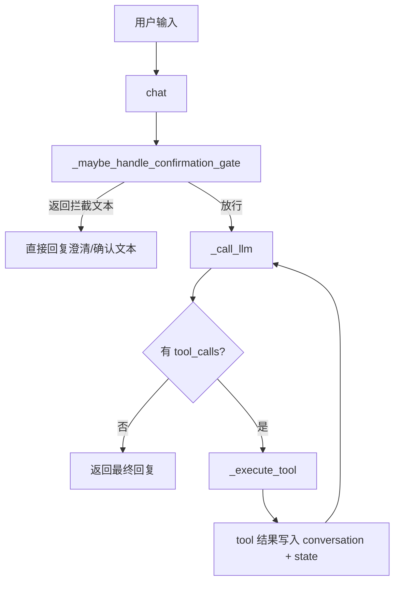

# GitHub 热门项目发现系统 — 设计文档

## Agent 交互逻辑（当前实现，2026-04）

本节用于快速理解 `agent.py` 的交互主路径与状态变量，解决“变量太多看不明白”的问题。

### 14.1 一句话总览

当前 Agent 采用“两阶段 + 一循环”：

1. 路由门控阶段：`_maybe_handle_confirmation_gate`（识别意图、参数、是否拦截澄清）
2. 执行循环阶段：`chat` + `_call_llm` + `_execute_tool`（ReAct 多轮工具调用）
3. 契约与状态阶段：执行契约、候选缓存、事实记忆共同保障结果可追溯

### 14.2 交互主流程

### 14.3 关键状态变量分组（按职责理解）

| 分组 | 关键变量 | 作用 |
|------|----------|------|
| 对话主线 | `conversation`, `current_user_turn`, `conversation_summary` | 保存多轮上下文与压缩摘要 |
| 路由门控 | `awaiting_confirmation`, `pending_request`, `last_confirmed_request` | 澄清/确认状态机 |
| 执行契约 | `current_turn_tools`, `current_turn_tool_call_count`, `current_turn_requires_tool_call` | 保证 fact_check 先取证再回答 |
| 榜单流水线缓存 | `last_search_repos` → `last_candidates` → `last_ranked` | 搜索→增长→排序的中间结果链 |
| 榜单参数缓存 | `last_mode`, `last_growth_calc_days`, `last_growth_threshold`, `last_min_star`, `last_candidate_days_since_created` | 维持本轮榜单执行参数一致性 |
| 去重与轮次 | `seen_repos`, `discovery_turn_id` | 新一轮榜单开始时重置并防重复 |
| 事实记忆 | `active_repo`, `recent_verified_claims` | 支持追问与 fact_check 复用 |

### 14.4 意图与工具暴露策略

当前策略是“默认开放，榜单受约束”：

1. `CONSTRAINED_TOOLS_BY_INTENT` 只约束三类榜单意图：`comprehensive_ranking`、`hot_new_ranking`、`keyword_ranking`
2. 其他意图默认开放工具集，保留 ReAct 自主选择
3. 顺序正确性不靠全量白名单，而靠前置条件校验与缓存链路

### 14.5 关于 INTENT_LABELS 的结论

是否要改成“只保留榜单 + freeform + unknown”？

结论：**当前不建议改**。

原因：

1. `INTENT_LABELS` 同时承担路由标准化白名单与展示标签职责，不只是“工具约束开关”
2. 若删除 `trending_only` / `repo_info` / `repo_growth` / `repo_description` / `db_info`，这些请求会在规范化阶段退化到 `unknown`
3. 这会导致既有能力（单仓库查询、Trending、DB 查询）语义变差，且需要同步改 prompt、默认参数与测试

如果产品范围未来明确收敛到“仅榜单”，再做整套收缩更安全（而不是只删标签）。

### 14.6 freeform_answer 与 unknown 是否应重合

结论：**不应重合，建议保持分离**。

语义边界：

1. `freeform_answer`：模型已理解请求，属于解释/比较/追问类，可直接回答或最小化取证
2. `unknown`：模型无法稳定理解请求，需要澄清重述（通常伴随低置信度）

若把两者合并，会丢失“已理解但不必走工具”和“未理解需澄清”这两种不同交互策略。

### 14.7 当前可读性优化清单（已落地）

1. 修正了 `_select_tools_for_llm` 注释缩进，避免误读
2. 为 `INTENT_LABELS` 增加“非工具约束集合”的说明，减少后续误删风险
3. 保持“少变量新增”原则，优先通过本节文档解释现有变量职责
